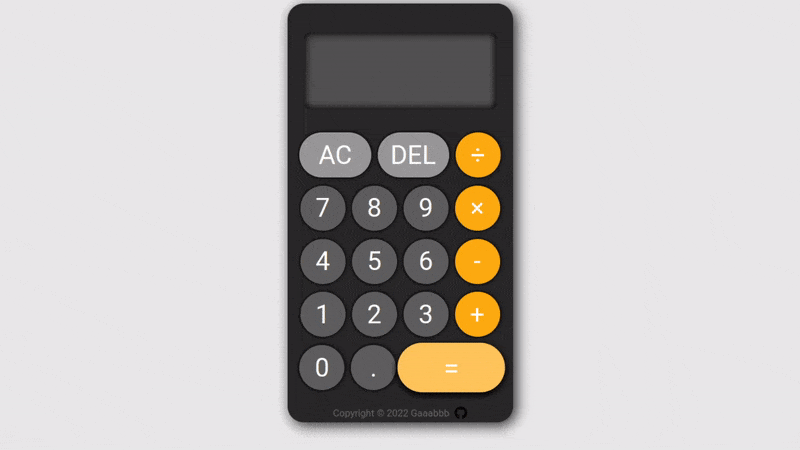
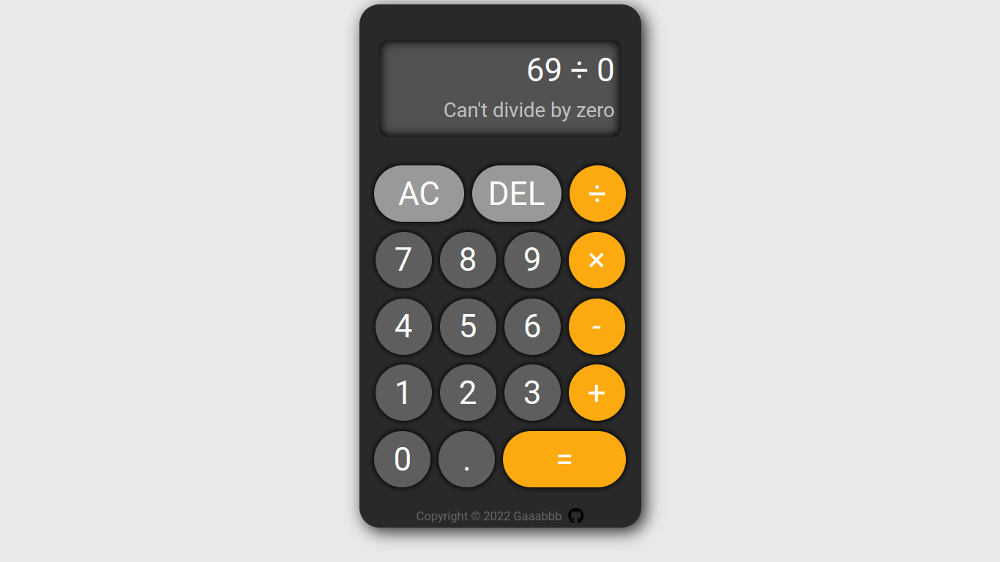

<h1 align="center">Calculator</h1>
<h3 align="center"><a href="https://gaaabbb.github.io/calculator/">:film_projector: Live Demo</a></h3>

## :scroll: Description
This project, which was created as part of TheOdinProject's Foundations Course, is a Calculator that has a simple functionality where only two variables are only allowed to be evaluated. The intention of this project is for me to utilize all the knowledge and experiences I gained in making the final assignment of the Foundations Course.

## :pencil2: Features
* A functional calculator that operates two variables.
* A clear all button and delete button.
* Allows decimals to be evaluated.
* Displays an error message when a number is divided by zero.
* Allows users to input numbers using keyboard.
* Keyboard Shortcuts: <kbd>A</kbd> for **All Clear**; <kbd>Backspace</kbd> or <kbd>Del</kbd> for **Delete**; <kbd>Enter</kbd> or <kbd>=</kbd> for **Operate**; <kbd>+</kbd> for **Addition**; <kbd>-</kbd> for **Subtraction**; <kbd>*</kbd> for **Multiplication**; <kbd>/</kbd> for **Division**; <kbd>.</kbd> for **Decimal**; Numbers <kbd>0</kbd> to <kbd>9</kbd> for **Numbers**.

## :framed_picture: Gallery
#### Adding Numbers

#### Error Message When Divided by Zero

#### Multiplying Decimals

## :computer: Languages Used
* HTML
* CSS
* JavaScript

## :left_speech_bubble: Reflection
This is actually the first time I've written a message as I have many thoughts about this project that I want to write here. Throughout my entire self-study of web-development, this project is the one that really boosted my interest in programming. The thought of making a function calculator is really mind-blowing for me and before I started my self-studying journey, I never really thought that I'd be capable to make this. It is true that there are many times where I had encountered challenges that is almost overwhelming for me, but when I got to solve and overcome it, it made me feel like that I'm the most genius person in the world (just kidding). This project made me realize how fun and exciting, yet scary and complex programming is. I really want to continue doing this a I'm hoping that I'll be a full-fledged web-developer in the future.